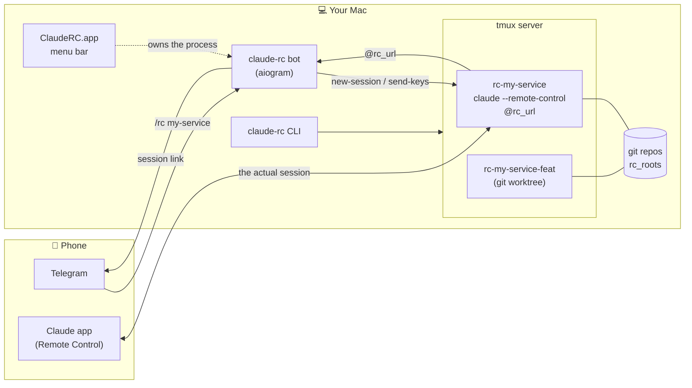

# claude-rc

**The "start a Claude Code session on my machine" button that was missing.**

[](https://github.com/nvinnikov/claude-rc/actions/workflows/ci.yml)
[](LICENSE)
[](https://www.python.org/downloads/)
[](#requirements)
[](pyproject.toml)

*Читать по-русски: [README.ru.md](README.ru.md)*


A Telegram bot that launches Claude Code sessions with Remote Control enabled on your own
machine and sends you the link. It never joins the conversation — it only starts it.

| | |
|---|---|
| **What it is** | Telegram bot + macOS menu bar app + CLI, one codebase |
| **Stack** | Python 3.12 / aiogram / tmux / git worktrees, Swift (SwiftPM) for the app |
| **Quality gate** | `ruff`, `mypy --strict` over code *and* tests, `pytest`, gitleaks — all in CI |
| **Distribution** | GitHub Releases, Homebrew tap, `uv tool install` |

---

## The problem

Claude Code has Remote Control: the session runs on your machine while you drive it from
your phone or the web. It's genuinely good — reading long answers, approving permissions
and keeping context inside the Claude app beats any chat wrapper.

But you can only *start* a session while sitting at the machine. Remote Control is a flag
on `claude`, and somebody has to type `claude` in a terminal. Until you're back at the
computer there is no way in: the tool is at home, the subscription is at home, the
repositories are at home — and you're at the store.

Cloud sessions don't close that gap, because they solve a different problem. The cloud
doesn't have your local repositories, your VPN, your kubeconfig, your signed-in MCP
servers or your uncommitted work. Standing up a fresh environment for every question is
its own chore; what you need is one door into the setup that already exists.

So you get a split: **the phone is the best way to run a session and the worst way to
create one.**

## The solution

A Telegram bot on that same machine. It does exactly one thing: runs `claude` with Remote
Control in the directory you picked and sends you the link. From there you move into the
Claude app and work.

The bot deliberately stays out of the conversation. The first version *was* a chat with an
agent, and it lost to the app on every count. So this one is only a starter: get to the
directory, tap, get a link.

From the phone it looks like this:

1. `📁 PWD` — a card with the directory tree;
2. tap through folders until you reach the one you want;
3. `▶️ Start Claude RC` — or `🌿 New worktree`, if something is already running there;
4. the link arrives → `Open in Claude` → you're working.

## How it works

`claude --remote-control` is an **interactive** command. Without a tty it falls back to
`--print` mode and dies with `Input must be provided either through stdin or as a prompt
argument`. A tmux pane provides that tty, so every session lives in its own tmux session
named `rc-<name>` — and the bot is only a client that hands tmux commands.



Two consequences fall out of that design:

- **sessions survive a bot restart** — the registry lives in tmux, not in the bot's memory;
- **you can attach from the machine itself**: `tmux attach -t rc-oms` opens the very same
  live terminal you're driving from your phone.

The session link is stored in the tmux user option `@rc_url`: the TUI repaints the pane and
wipes the link out of the visible buffer, and after a bot restart there would be nowhere
else to read it from.

### Module map

| Module | Responsibility |
|---|---|
| `clauderc/remote.py` | everything tmux: start a session, harvest the link, kill it |
| `clauderc/worktrees.py` | git worktree per branch: create, inspect, remove |
| `clauderc/browse.py` | directory tree navigation (`cd`/`ls`) |
| `clauderc/repos.py` | walking `rc_roots` looking for git repositories |
| `clauderc/state.py` | current directory across restarts (JSON) |
| `clauderc/config.py` | reading `config.toml` |
| `clauderc/bot.py` | aiogram handlers, cards and buttons |
| `clauderc/paths.py` | where the config, the log and Claude Code's transcripts live |
| `clauderc/history.py` | Claude Code transcripts for a directory (for resuming) |
| `clauderc/watch.py` | polling tmux: notices vanished sessions, marks intentional kills |
| `clauderc/cli.py` | the `claude-rc` command: the same actions from a terminal |
| `clauderc/sync.py` | repo state vs. origin and fast-forwarding — shared by bot and CLI |
| `app/` | `ClaudeRCMenu` Swift package: menu bar app that owns the bot process |

All the logic lives in the modules; `bot.py` only assembles messages out of it.

Not a single character typed. Sessions live in tmux, so they survive a bot restart, and once
you're home you can attach to them straight from a terminal: `tmux attach -t rc-<name>`.

## Using it from Telegram

Two ways to pick where a session goes up: walk there, or call it by name.

### Walk there

```
/pwd            where am I
/cd services    go in
/cd ..          go up
```

`/pwd` sends a card: the current path and buttons for the subdirectories (git repositories
marked with `●`), plus `⬆️ ..` and `▶️ Start Claude RC`. On a phone that beats typing paths:
you tap through the tree and launch without entering anything. The current directory survives
a bot restart.

`/cd` understands relative paths, absolute paths, `..` and `~`.

Inside a git repository a `🌿 New worktree` button appears — it starts a session in a fresh
worktree on a branch named like `wt/20260730-131502`. That's how you work in parallel with an
already-running session when the branch name doesn't matter.

`📚 Projects` (`/repos`) — a flat list of every git repository as buttons: a tap takes you
straight into the directory, no tree-walking. Identical names (two clones of one repository)
are disambiguated by their parent directory.

A persistent keyboard sits under the input field: `📁 PWD`, `💬 Chats`, `📚 Projects`,
`⌨️ Commands`. It appears after `/start`.

If a session is already alive in a directory you get its link back rather than a second
session — sessions are keyed by working directory, not by name.

### Repository sync

In a directory that holds at least one git repository (itself or in its subdirectories), the
`/pwd` card grows a `🔄 Sync` button. A tap opens selection mode: one line per repository —
name, branch and state (⚠ no upstream, `↓N`/`↑N` behind and ahead of origin **as of the last
fetch**, `✎` dirty, `✓` clean, 🔒 an RC session is live in that directory right now).

Tick the repositories you want or press "All"/"None"; the "Branch" button asks for a name as
a reply to the same message (or `-` to stay on the current one); "⤵️ Pull" runs `sync` over
the ticked ones and reports one line per repository — the same rules and glyphs as
`claude-rc sync` (see [CLI](#cli)). "Cancel" returns the normal navigation card.

`🔒` means "we won't switch the branch", not "we won't touch the repository": the
fast-forward (`pull --ff-only`) still happens there. A dirty or diverged repository is
filtered out earlier and is never harmed, but files do get updated while Claude is working
in that directory. Claude Code checks a file's mtime before editing and will refuse to
write over something changed underneath it — but a `git commit -am` from that same session
will land on the already-updated tree.

### Call things by name

| Command | Action |
|---|---|
| `/rc <repo>` | Start a session, reply with the link |
| `/rc <repo> <branch>` | Same, but in a separate git worktree |
| `/rc` | Live sessions |
| `/repos` | All git repositories as buttons |
| `/rckill <name>` | Kill a session (no name — all of them) |
| `/wt` | All worktrees as buttons |
| `/wtrm <name>` | Remove a worktree |

Names are looked up under `rc_roots` down to `scan_depth`. An exact match starts right
away; several matches produce a choice of buttons.

A session is identified by its working directory, not by its name: a repeated `/rc` in the
same directory returns the existing link, and two clones of the same repository get two
different sessions.

### What's running and what's left over

`💬 Chats` shows both halves of the picture.

First the live sessions — one message each, with `Open in Claude` and `⏹ Stop` buttons. If
a session runs in a worktree, the card shows the branch and its state.

Then the worktrees left **without** a session. That's the unfinished work: each gets
`▶️ Start` (bring a session back up in the same directory) and `🗑 Remove`. There is
deliberately no separate worktree button at the bottom — without a session a worktree isn't
a first-class thing, it's a leftover, and its place is next to the sessions.

`🗑 Remove` refuses to delete a directory with uncommitted changes or with commits that
exist on no remote, and shows the reason with a `🗑 Remove anyway` button. Stopping a
session doesn't touch the worktree at all.

In text: `/rckill <name>` (no name — all), `/wt` for all worktrees including busy ones,
`/wtrm <name> [force]`.

### Parallel work in one repository

Two sessions in one directory inevitably fight — shared index, shared branch, shared files.
So a second session on the same repository goes through a worktree:

```
/rc my-service feature/DEV-123
```

An existing branch is reused (including remote-only ones); if there is none, it's created
from the current `HEAD`. The directory appears under `worktree_root` and is reused on the
next launch.

`/wt` shows what's going on in each worktree. `/wtrm` refuses to delete a directory with
uncommitted changes or with commits that exist on no remote; an explicit `/wtrm <name> force`
overrides the refusal. `/rckill` never touches worktrees at all — it only kills the session.

### Directory trust

In an unfamiliar directory `claude` asks whether you trust the folder, and prints no link
until you answer. That dialog can only be skipped in `--print` mode, and Remote Control
requires interactivity — so the bot sends you a `Trust` button. It will not answer on your
behalf: until you tap, the session simply waits. Asked once per directory; `claude`
remembers after that.

## Requirements

- `tmux` — `brew install tmux` (sessions live inside it);
- `claude` on `PATH`;
- Python 3.12 and `uv`.

## Install

Three ways, by increasing distance from the sources:

- **from a clone** — `make install` (see below);
- **from a GitHub release** — download `ClaudeRC.app.zip` and the package from the
  [releases page](https://github.com/nvinnikov/claude-rc/releases); see [Releases](#releases)
  about clearing quarantine;
- **via Homebrew** —

  ```bash
  brew install nvinnikov/tap/claude-rc-app
  ```

  installs both the tool and the app (the `claude-rc` formula comes in as a cask
  dependency). Tool only, no app: `brew install nvinnikov/tap/claude-rc`. The formula and
  cask sources live in `packaging/homebrew/` in this repository; the tap itself is
  `nvinnikov/homebrew-tap` (see `packaging/homebrew/README.md` for how it's updated per
  release).

  The cask, like a manual install from the zip, quarantines the downloaded bundle — there
  is no Developer ID signature, so it needs the same quarantine removal as in
  [Releases](#releases) (`brew` prints the command in its caveats). The formula builds
  `pydantic-core` (an `aiogram` dependency) from Rust sources, so `brew install` takes
  minutes rather than seconds — that's not a hang.

  If the tool is already installed via `uv tool install` into `~/.local/bin` and that
  directory comes earlier on `PATH` than `brew --prefix` (`/opt/homebrew/bin` on Apple
  Silicon), `claude-rc` by name keeps resolving to the old copy. `brew` warns about this
  (`shadowed by ...`); `claude-rc version` shows a copy's version, `which claude-rc` its
  path.

`make install` does everything in one command: the `claude-rc` tool into `~/.local/bin`
(via `uv tool install`) and `ClaudeRC.app` into `/Applications`. The app is killed before
copying — otherwise `cp` writes files underneath a running process and you get a
half-stale bundle. If the menu bar icon disappears after `make install`, that's why: just
open the app again.

The Telegram bot goes down with the app: until you reopen `ClaudeRC.app` by hand, Telegram
commands aren't processed. Already-running tmux sessions (`rc-*`) survive the install — only
the wrapper process is killed, and the session registry lives in tmux, not in the bot's
memory.

After installing, open the app once by hand and tick `Launch at login` — it doesn't enable
itself.

Tool only, no app (e.g. a headless machine): `make install-tool`.

### Updating

`make update` is the whole update in one command: `git pull --rebase`, the `make check`
gate, a reinstall, and the app started back up. It refuses on a dirty tree rather than
stashing your work for you — to install code you haven't committed, use `make install`.

Only the install itself takes the bot down. Running tmux sessions (`rc-*`) survive it:
they live in the tmux server, and the bot reads their links back out of the `@rc_url`
tmux option on startup.

## First run

Right after installing there's no config yet — the bot fails at startup and `Reveal config`
in the app opens an empty directory. `claude-rc setup` fills it in interactively:

```bash
claude-rc setup
```

It asks three things:

- **the bot token** from @BotFather — entered hidden (like a terminal password) and
  immediately verified with a `getMe` call, so a typo never reaches the bot's crash loop;
- **your Telegram user_id** — either typed in, or auto-detected: the bot listens for up to
  two minutes and takes the sender id of the first message addressed to it. Auto-detection
  is only offered on a true first run, when no `config.toml` exists at all — if a file is
  already there (even a broken one, say with a vanished directory in `rc_roots`) or a
  `claude-rc bot` process is already visible in the system, the wizard skips straight to
  manual entry so it never starts a second poller on the same token;
- **the directories holding your repositories**, comma-separated (default: `~/Documents`).

It writes `~/.config/claude-rc/config.toml` with mode `600` (and the directory `700`) —
that file holds a live token; a repeat run narrows the permissions even if the file used to
be wider. A repeat `claude-rc setup` pre-fills the previous values as hints and changes only
what you answer — an empty answer keeps the old value. Four technical fields the wizard
never asks about (`worktree_root`, `state_path`, `scan_depth`, `launch_timeout_s`) are
carried over verbatim on rewrite; anything else outside that list (including human
comments) is not preserved.

Then open the ClaudeRC app or run `claude-rc bot`.

### Manual install

1. `uv sync`
2. Fill in `config.toml` from `config.example.toml`:
   - working in a clone — `cp config.example.toml config.toml` (next to the sources, for
     development without environment variables);
   - installed tool — `cp config.example.toml ~/.config/claude-rc/config.toml` (create the
     directory first).

   Fields:
   - `bot_token` — from @BotFather
   - `allowed_user_id` — your Telegram user_id (ask @userinfobot)
   - `rc_roots` — where to look for repositories
3. `chmod 600 config.toml`

The config is looked up in order: the path in `$CLAUDE_RC_CONFIG` if set; otherwise
`~/.config/claude-rc/config.toml`; otherwise `config.toml` in the current directory. The
first file that exists wins.

**Field types are strict.** `bot_token`, `worktree_root`, `state_path` are strings;
`allowed_user_id`, `scan_depth` are integers; `launch_timeout_s` is a number; `rc_roots` is
a string or a list of strings. A wrongly typed value used to slip silently through
`int()`/`float()` (a quoted number like `allowed_user_id = "123"` — a common way to write
numbers in many formats — would read as a string and blow up at the bot's first start).
Now `claude-rc doctor` or the bot itself names the field and the expected type right away.

## Run

By hand: `make run` (identical to `claude-rc bot` — see [CLI](#cli)).

Menu bar app: `make app` builds `ClaudeRC.app` into `app/build/` — no Xcode needed, the
bundle is assembled by `app/make-app.sh` from the SwiftPM binary. The build directory is
kept out of Spotlight (a `.metadata_never_index` marker): the build copy carries the same
bundle id as the installed one, and without it search and Launchpad list two ClaudeRCs. Move `ClaudeRC.app` to
`/Applications` and launch it: the bot lives inside the app as a child process, the menu bar
icon reflects its state, `Stop bot`/`Start bot` control it by hand. `Launch at login`
registers the app through `SMAppService` and the toggle survives restarts. `Quit` the app
and the bot goes down with it.

For the bot to answer, the Mac must not sleep: `sudo pmset -c sleep 0`.

## CLI

The same actions as the bot, from a terminal on the machine itself — no waiting for a
message to make the round trip through Telegram. Installed with the package:

```bash
uv tool install .
```

| Command | Action |
|---|---|
| `claude-rc version` | version |
| `claude-rc sessions [--json]` | live RC sessions |
| `claude-rc start [path] [--branch b] [--resume last\|id]` | start a session (default: current directory) |
| `claude-rc stop <name\|path>` / `claude-rc stop --all` | kill a session |
| `claude-rc doctor [--json]` | check tmux, claude and the config |
| `claude-rc setup` | first-run wizard — token, user_id, directories |
| `claude-rc sync [paths…] [--branch b] [--no-fetch]` | fast-forward repositories from origin |
| `claude-rc bot` | run the Telegram bot in the foreground — same as `make run` |

The trust dialog for an unfamiliar directory is asked straight on stdin: there's a human at
the terminal, and their answer *is* the decision about access to that directory — no
auto-confirm here either. With no tty (in a script, say) `start` doesn't hang waiting for
input: it exits with code 2 and a hint to `tmux attach -t rc-<name>` and answer in the pane.

### Repository sync

```bash
claude-rc sync                        # every repository in the current directory
claude-rc sync ~/code/a ~/code/b      # only the listed ones
claude-rc sync --branch main          # switch to main before pulling
claude-rc sync --no-fetch             # inspect state without touching the network
```

Pulls from origin strictly by fast-forward (`git pull --ff-only`) — no `merge`, `rebase`,
`stash` or `reset`. A repository with uncommitted changes is not touched at all: neither
branch switch nor pull. Branches diverged from origin are a `failed`: no fast-forward is
possible and it needs a human. A missing upstream isn't an error — it's a skip with a reason
in the report.

`--branch` switches branches before pulling (a branch existing locally or only on origin),
but only in a clean repository, and never where switching is dangerous: not in **any** git
worktree (it would zero out the unpushed-commit count and disarm `wtrm`'s protection against
deletion, live session or not — see [Design notes](#design-notes)), and not where an RC
session is running right now (swapping the branch under a live session is lost silently in
the app). The fast-forward itself does not skip those directories — only the branch switch;
see `🔒` above. `--no-fetch` doesn't touch the network at all: if a repository is behind, the
command says so but won't pull — handy for checking the list of stale repositories without
paying for a fetch across all of them.

Each report line is one repository: `⤵` pulled, `=` already current, `·` skipped, `✗`
failed; a tally per outcome at the end. With no arguments it syncs the repositories directly
inside the current directory (not recursively); explicit paths sync only those. Repositories
are walked in parallel.

## Design notes

The non-obvious constraints this project is built around — the ones that cost debugging time
and shaped the code:

- **A session's key is its working directory, not its name.** Repository names in a tree
  aren't unique (two clones of one repo), and name lookup handed back a link to a session in
  someone else's directory. `find(cwd)` compares `realpath`; the tmux session name survives
  for display only.
- **tmux 3.x target syntax isn't uniform.** `=name` (exact match) works for
  `has-session`/`kill-session`, but where a target-pane is expected (`capture-pane`,
  `set-option`) you need `=name:`. Without `=`, `rc-oms` matches `rc-oms-2`.
- **The link can't live in the pane alone.** The TUI repaints and erases it, and after a bot
  restart there's nowhere to read it from — hence the tmux user option `@rc_url`.
- **The pane size is set explicitly** (`-x 120 -y 40`). A pane with no attached client is
  tiny, and the TUI wraps lines so that the link breaks in half.
- **`CLAUDE_CODE_*` is scrubbed inside the pane.** The tmux server may have been started
  from within Claude Code; an inherited `CLAUDE_CODE_CHILD_SESSION` starts the session with
  "Transcript saving is off" — that is, with no history.
- **The trust dialog is never bypassed silently.** `await_url` raises `TrustRequired` without
  killing the session, and `Enter` reaches the pane only after a human presses the button.
  Auto-confirm is not our call to make: it's a decision about access to a directory.
- **Telegram serves `InaccessibleMessage`** for messages that are too old — it has no
  `edit_text`. Callbacks narrow through `_live_message(query)`, not `if query.message is None`.
- **`callback_data` holds 64 bytes.** No paths or names go in there: either an index into the
  current list or a short token from a dict.
- **The directory slug in `~/.claude/projects` is per-character.** Every character outside
  `[A-Za-z0-9]` is replaced by `-` individually, runs are not collapsed: `/Users/n/.x` gives
  `-Users-n--x`. And the slug is ambiguous by construction, so `history` confirms the match
  against the `cwd` field inside the file.
- **Sessions are never killed behind the `Watcher`'s back.** The watcher treats any
  disappearance it didn't mark as expected as a crash — a direct `remote.kill_tmux` from a
  handler would hand the user a "session crashed" card right after they pressed Stop
  themselves.
- **An app launched at login gets a bare `PATH`.** The bot it spawns as a child would find
  neither `tmux` nor `claude` without an explicit `PATH` — `CLILocator.childEnvironment`
  exists for exactly that.
- **Two pollers on one token break the bot silently.** Telegram returns a conflict and both
  instances work every other time. Before starting its own process, the app looks for a
  foreign one and shows its pid instead of launching.
- **`sync --branch` inside a worktree could zero out the `wtrm` guard.** A worktree's
  `blockers` are computed against the current branch; switch it and the commits stay on the
  old branch (not lost — `git branch` sees them) while `unpushed` for the new branch is
  honestly zero, so `wtrm` without `force` would stop refusing. `sync.py` therefore refuses
  to switch branches in **any** worktree, independently of whether a live RC session is
  there — two separate checks, either one is enough.
- **`.requiresApproval` from `SMAppService.mainApp.register()` is not an error.** It's
  success pending a human's confirmation in System Settings. Mistaking it for a failure and
  adding a hand-rolled LaunchAgent on top gives you two autostart mechanisms and a doubled
  bot.

## Permissions and trade-offs

**There is no permission gate on the bot's side.** An RC session is interactive; write and
execute permissions are granted in the Claude app. The only defence is the `allowed_user_id`
check: whoever passes it gets a full Claude Code on this machine, with every token in `~`.
There is no isolation. That's a deliberate trade-off, not an unfinished feature — don't
"fix" it with half-measures inside the bot.

**Previews of old conversations go through Telegram.** When a directory already has history,
the bot offers a choice — new conversation, resume the last, or one of the earlier ones — and
labels the buttons with the first 80 characters of the human's first message from
`~/.claude/projects`. Only paths used to travel to Telegram; now a fragment of the
conversation does too. There is exactly one recipient — the bot's owner — and button text
carries no injection risk, but if a secret was pasted into a conversation's first message, it
ends up on Telegram's servers. A deliberate trade-off for the convenience of resuming. It can
be turned off without touching code: don't use the resume fork — start sessions via
`🌿 New worktree` or `/rc <repo> <branch>`; a fresh worktree has no history and nothing to
preview.

## Releases

A `v<version>` tag (e.g. `v0.1.0`) triggers `.github/workflows/release.yml`: the quality
gate, building `ClaudeRC.app.zip`, sdist and wheel, publishing a GitHub release. The version
in the tag must match `version` in `pyproject.toml` — otherwise the build fails on the first
step, before doing any work. That's the only thing standing between you and a release where
`claude-rc version` prints something different from the release page.

macOS will refuse to open a downloaded `.app` on first launch: quarantine
(`com.apple.quarantine`) is applied to everything that didn't come from the App Store, and we
have no Developer ID signature — that costs money and an Apple developer account, neither of
which is worth it for a home project. Clear it by hand:

```bash
xattr -dr com.apple.quarantine /Applications/ClaudeRC.app
```

Pre-release tags (`v0.1.0-rc1`) are currently impossible: the version check compares the tag
literally against `version` in `pyproject.toml`, while `uv build` normalises a suffix like
`-rc1` per PEP 440 (`0.1.0rc1`) — the mismatch just reappears from the other side. For now
that's a limitation, not a workaround: versions are `X.Y.Z` only.

## Development

```bash
make check       # mirrors CI: ruff format --check, ruff check, mypy --strict, pytest
make format      # autoformat and autofix
make run         # run the bot by hand
```

CI (GitHub Actions) runs the same four steps plus a gitleaks secret scan. `mypy --strict`
covers the whole codebase *and* the tests.

A separate workflow has Claude Code Action review PRs against the rules in
[CLAUDE.md](CLAUDE.md#code-review-guidelines). Two one-off steps make it work: install the
[GitHub App](https://github.com/apps/claude) on the repository and put a token in the
secrets —

```bash
claude setup-token                       # prints a token
gh secret set CLAUDE_CODE_OAUTH_TOKEN    # paste it here
```

Without the token the job is silently skipped and PRs don't go red.

## Tests

`make test` or `uv run pytest`

Fast and offline, in two styles:

- `test_remote.py` stubs out `remote._run` — no tmux is started. Plus one end-to-end test on
  a real tmux with a fake `claude` (that's what the `CLAUDE_BIN` constant is for); without
  tmux it's skipped.
- `test_worktrees.py` works on real temporary git repositories: git is fast, and mocking it
  in enough detail would leave the test proving nothing.

The end-to-end test runs on a separate tmux server (`CLAUDE_RC_TMUX_SOCKET`), isolated from
the default one, so it neither trips over live `rc-*` sessions nor is seen by the watcher.
The same variable can be set by hand to run a sandbox away from real sessions.

## License

[MIT](LICENSE) © Nikita Vinnikov
