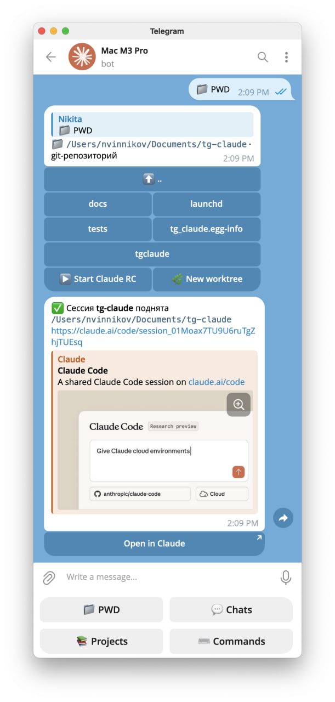

# claude-rc

**Кнопка «начать сессию Claude Code на своей машине», которой не хватало.**



## Проблема

У Claude Code есть Remote Control: сессия крутится на твоей машине, а управляешь ей
с телефона или из веба. Штука отличная — читать длинные ответы, подтверждать права и
держать контекст в приложении Claude несопоставимо удобнее, чем в чате-обёртке.

Но начать сессию можно только сидя за машиной. Remote Control — это флаг у `claude`,
а `claude` кто-то должен набрать в терминале. Пока ты не за компьютером, входа нет:
инструмент дома, подписка дома, репозитории дома — а ты в магазине.

Облачные сессии эту дыру не закрывают, потому что решают другую задачу. В облаке нет
твоих локальных репозиториев, VPN, kubeconfig, залогиненных MCP-серверов и
незакоммиченной работы в рабочей копии. Поднимать под каждый вопрос отдельное
окружение — отдельная возня, а нужен-то один вход в то, что уже стоит и настроено.

Получается разрыв: **телефон — лучший способ вести сессию и при этом худший способ
её создать.**

## Решение

Telegram-бот на той же машине. Он делает ровно одно: запускает `claude` с Remote
Control в нужном каталоге и присылает ссылку. Дальше ты уходишь в приложение Claude
и работаешь там.

Сам бот в диалоге не участвует — и это осознанно. Первая версия была чатом с агентом,
и оказалась хуже приложения по всем статьям. Поэтому здесь он только «стартер»:
довести до каталога, нажать, получить ссылку.

С телефона это выглядит так:

1. `📁 PWD` — карточка с деревом каталогов;
2. тапаешь по папкам, пока не дойдёшь до нужной;
3. `▶️ Start Claude RC` — или `🌿 New worktree`, если параллельно уже что-то запущено;
4. приходит ссылка → `Open in Claude` → работаешь.

Ни одного набранного символа. Сессии живут в tmux, поэтому переживают перезапуск бота,
а придя домой к ним можно подсесть прямо из терминала: `tmux attach -t rc-<имя>`.

## Возможности

Два способа выбрать, где поднять сессию: дойти ногами или назвать по имени.

### Дойти ногами

```
/pwd            где я сейчас
/cd services    перейти
/cd ..          на уровень выше
```

`/pwd` присылает карточку: текущий путь и кнопки по подкаталогам (git-репозитории
помечены `●`), плюс `⬆️ ..` и `▶️ Start Claude RC`. С телефона это удобнее, чем
печатать пути: тапаешь по дереву и запускаешь, не набрав ни символа. Текущий
каталог переживает перезапуск бота.

`/cd` понимает относительный путь, абсолютный, `..` и `~`.

В git-репозитории рядом появляется `🌿 New worktree` — поднимает сессию в свежем
worktree с веткой вида `wt/20260730-131502`. Это способ работать параллельно с уже
запущенной сессией, когда имя ветки не важно.

`📚 Projects` (`/repos`) — плоский список всех git-репозиториев кнопками: тап
переносит прямо в каталог, ходить по дереву не нужно. Одинаковые имена (два клона
одного репозитория) разводятся именем родителя.

Под полем ввода висит постоянная клавиатура: `📁 PWD`, `💬 Chats`, `📚 Projects`,
`⌨️ Commands`. Появляется после `/start`.

### Назвать по имени

| Команда | Действие |
|---|---|
| `/rc <репо>` | Поднять сессию, ответить ссылкой |
| `/rc <репо> <ветка>` | То же, но в отдельном git worktree |
| `/rc` | Живые сессии |
| `/repos` | Все git-репозитории кнопками |
| `/rckill <имя>` | Погасить сессию (без имени — все) |
| `/wt` | Все worktree с кнопками |
| `/wtrm <имя>` | Удалить worktree |

Имя ищется по каталогам из `rc_roots` на глубину `scan_depth`. Точное совпадение
запускается сразу, несколько совпадений — кнопки выбора.

Сессия опознаётся по рабочему каталогу, а не по имени: повторный `/rc` в том же
каталоге вернёт существующую ссылку, а два клона репозитория с одинаковым именем
получат разные сессии.

### Что запущено и что осталось

`💬 Chats` показывает обе половины картины.

Сначала живые сессии — по сообщению на каждую, с кнопками `Open in Claude` и
`⏹ Stop`. Если сессия работает в worktree, в карточке видна ветка и её состояние.

Следом — worktree, оставшиеся **без** сессии. Это и есть недоделанная работа:
у каждого кнопки `▶️ Start` (поднять сессию заново в том же каталоге) и
`🗑 Remove`. Отдельной кнопки под worktree внизу нет специально — без сессии он
не самостоятельная сущность, а остаток, и место ему рядом с сессиями.

`🗑 Remove` откажется удалять каталог с незакоммиченными изменениями или с
коммитами, которых нет ни на одном remote, и покажет причину с кнопкой
`🗑 Remove anyway`. Остановка сессии worktree не трогает вообще.

Текстом: `/rckill <имя>` (без имени — все), `/wt` — все worktree включая занятые,
`/wtrm <имя> [force]`.

### Параллельная работа в одной репе

Две сессии в одном каталоге неизбежно дерутся — общий индекс, общая ветка, общие
файлы. Поэтому вторая сессия по тому же репозиторию заводится через worktree:

```
/rc my-service feature/DEV-123
```

Ветка берётся существующая (в том числе remote-only), а если такой нет — создаётся
от текущего `HEAD`. Каталог появляется в `worktree_root` и переиспользуется при
повторном запуске.

`/wt` показывает, что в каждом worktree происходит. `/wtrm` откажется удалять
каталог с незакоммиченными изменениями или с коммитами, которых нет ни на одном
remote; перебить отказ можно явным `/wtrm <имя> force`. `/rckill` worktree не
трогает вообще — гасит только сессию.

### Доверие каталогу

В незнакомом каталоге `claude` спрашивает, доверяешь ли ты папке, и до ответа
ссылку не печатает. Пропустить диалог можно только в `--print`, а Remote Control
требует интерактива — поэтому бот присылает кнопку `Trust`. Отвечать за тебя он
не станет: до нажатия сессия просто ждёт. Спрашивается один раз на каталог,
дальше `claude` помнит сам.

## Требования

- `tmux` — `brew install tmux` (сессии живут в нём);
- `claude` в `PATH`;
- Python 3.12 и `uv`.

## Установка

Три способа, по возрастанию расстояния от исходников:

- **из клона репозитория** — `make install` (см. ниже);
- **из релиза на GitHub** — скачать `ClaudeRC.app.zip` и пакет со
  [страницы релизов](https://github.com/nvinnikov/claude-rc/releases), см. раздел
  «Релиз» ниже про снятие карантина;
- **через Homebrew** — `brew install nvinnikov/tap/claude-rc-app` поставит и
  тулзу, и приложение. Формула и cask лежат в `packaging/homebrew/`, но
  репозиторий `nvinnikov/homebrew-tap` пока не создан — этот способ ещё не
  заработает, пока его не завести руками (см. `packaging/homebrew/README.md`).
  Cask, как и ручная установка из зипа, ставит карантин на скачанный бандл —
  подписи Developer ID нет, поэтому после установки нужно то же самое снятие
  карантина, что и в разделе «Релиз» ниже (`brew` печатает команду в caveats
  после установки).

`make install` ставит всё одной командой: тулзу `claude-rc` в `~/.local/bin` (через
`uv tool install`) и `ClaudeRC.app` в `/Applications`. Приложение перед копированием
гасится, если уже запущено, — иначе `cp` кладёт файлы под работающим процессом и
бандл получается наполовину старым. Если иконка в меню-баре после `make install`
пропала — это она, просто открой приложение заново.

Вместе с приложением гасится и Telegram-бот внутри него: пока не откроешь
`ClaudeRC.app` заново руками, команды из Telegram обрабатываться не будут.
Уже поднятые tmux-сессии (`rc-*`) установку при этом переживают — гасится
только сам процесс-обёртка, реестр сессий живёт в tmux, а не в памяти бота.

После установки приложение нужно один раз открыть руками и поставить галочку
`Launch at login` — сама она не включается.

Собрать и поставить только тулзу без приложения (например, на машине без графики):
`make install-tool`.

### Установка руками

1. `uv sync`
2. Заполни `config.toml`, скопировав `config.example.toml`:
   - работа в клоне репозитория — `cp config.example.toml config.toml` (файл рядом
     с исходниками, для разработки без переменных окружения);
   - установленная тулза — `cp config.example.toml ~/.config/claude-rc/config.toml`
     (каталог создать заранее).

   Заполнить:
   - `bot_token` — от @BotFather
   - `allowed_user_id` — твой Telegram user_id (узнать у @userinfobot)
   - `rc_roots` — где искать репозитории
3. `chmod 600 config.toml`

Конфиг ищется по цепочке: путь из `$CLAUDE_RC_CONFIG`, если задан; иначе
`~/.config/claude-rc/config.toml`; иначе `config.toml` в текущем каталоге. Первый
существующий файл и используется.

## Запуск

Вручную: `make run` (то же самое, что `claude-rc bot` — см. раздел «CLI»).

Приложение в меню-баре. `make app` собирает `ClaudeRC.app` в `app/build/` —
Xcode не нужен, бандл складывается скриптом `app/make-app.sh` из бинаря SPM.
Перенеси `ClaudeRC.app` в `/Applications` и запусти: бот живёт внутри
приложения как дочерний процесс, иконка в меню-баре показывает его состояние,
`Stop bot`/`Start bot` включают и гасят его вручную. Галочка `Launch at login`
регистрирует приложение через `SMAppService` — тумблер переживает перезапуск.
Закрыл приложение (`Quit`) — бот погас вместе с ним.

Чтобы бот отвечал, мак не должен засыпать: `sudo pmset -c sleep 0`.

## CLI

Те же действия, что у бота, но из терминала на самой машине — не нужно ждать,
пока сообщение дойдёт из Telegram. Ставится вместе с пакетом:

```bash
uv tool install .
```

| Команда | Действие |
|---|---|
| `claude-rc version` | версия |
| `claude-rc sessions [--json]` | живые RC-сессии |
| `claude-rc start [путь] [--branch ветка] [--resume last\|id]` | поднять сессию (по умолчанию — текущий каталог) |
| `claude-rc stop <имя\|путь>` / `claude-rc stop --all` | погасить сессию |
| `claude-rc doctor [--json]` | проверить tmux, claude и конфиг |
| `claude-rc bot` | запустить Telegram-бота на переднем плане — то же, что `make run` |

Диалог доверия незнакомому каталогу (см. «Доверие каталогу» выше) в CLI
спрашивается прямо на stdin: за терминалом сидит человек, и его ответ — это и
есть решение о правах на каталог, автоподтверждения нет и здесь. Без tty
(например, в скрипте) `start` не подвисает в ожидании ввода, а падает с кодом
2 и подсказкой `tmux attach -t rc-<имя>`, чтобы ответить в панели вручную.

## Как это устроено

`claude --remote-control` — интерактивная команда, без tty она уходит в режим
`--print` и падает. Панель tmux даёт tty, поэтому каждая сессия живёт в своей
tmux-сессии `rc-<имя>`.

Отсюда два следствия:

- **сессии переживают рестарт бота** — реестр не в памяти бота, а в tmux;
- **можно подсесть с самой машины**: `tmux attach -t rc-oms` открывает тот же
  живой терминал, которым ты управляешь с телефона.

Ссылка на сессию хранится в user-опции tmux `@rc_url`: TUI перерисовывает панель
и вытирает её из видимого буфера, а после рестарта бота её нужно откуда-то взять.

## Права

**Гейта прав на стороне бота нет.** RC-сессия интерактивная, разрешения на запись
и выполнение команд выдаются в приложении Claude. Единственная защита — проверка
`allowed_user_id`: кто её прошёл, получает на этой машине полноценный Claude Code
со всеми токенами в `~`. Изоляции нет, это осознанный размен.

**Превью старых диалогов уходит в Telegram.** Когда в каталоге уже есть история,
бот предлагает выбор — новый диалог, продолжить последний или один из прежних —
и подписывает кнопки первыми 80 символами первого сообщения человека из
`~/.claude/projects`. Раньше в Telegram уезжали только пути, теперь — обрывок
переписки. Адресат один — владелец бота, инъекции текст кнопки не несёт, но если
в первом сообщении диалога был вставлен секрет, он окажется на серверах Telegram.
Это осознанный размен ради удобства резюма, а не недосмотр. Выключить можно, не
трогая код: не пользоваться развилкой резюма — поднимать сессии через `🌿 New
worktree` или `/rc <репо> <ветка>`, для свежего worktree истории ещё нет, и
превью показывать нечего.

## Релиз

Тег вида `v<версия>` (например `v0.1.0`) запускает `.github/workflows/release.yml`:
гейт, сборка `ClaudeRC.app.zip`, sdist и wheel, публикация релиза на GitHub. Версия
в теге обязана совпадать с `version` в `pyproject.toml` — иначе сборка падает на
первом шаге, до всякой работы. Это единственная защита от релиза, в котором
`claude-rc version` печатает не то, что написано на странице релиза.

Скачанный `.app` при первом запуске macOS откажется открывать: карантин
(`com.apple.quarantine`) ставится на всё, что пришло не из App Store, а подписи
Developer ID у нас нет — это стоит денег и учётной записи разработчика Apple,
которых для домашнего проекта заводить незачем. Снять карантин руками:

```bash
xattr -dr com.apple.quarantine /Applications/ClaudeRC.app
```

Предрелизные теги (`v0.1.0-rc1`) сейчас невозможны: проверка версии сравнивает
тег буквально с `version` из `pyproject.toml`, а `uv build` нормализует суффикс
вроде `-rc1` по PEP 440 (`0.1.0rc1`) — расхождение с тегом появится просто
с другой стороны. Пока это ограничение, не обходной путь: версии — только вида
`X.Y.Z`.

## Разработка

```bash
make check       # зеркало CI: ruff format --check, ruff check, mypy --strict, pytest
make format      # автоформат и автофиксы
make run         # запустить бота вручную
```

CI (GitHub Actions) гоняет те же четыре шага плюс скан секретов gitleaks.

Отдельным воркфлоу PR ревьюит Claude Code Action по правилам из
[CLAUDE.md](CLAUDE.md#code-review-guidelines). Чтобы он заработал, нужно два
разовых действия: поставить на репозиторий [GitHub App](https://github.com/apps/claude)
и положить токен в секреты —

```bash
claude setup-token                       # выдаст токен
gh secret set CLAUDE_CODE_OAUTH_TOKEN    # вставить его сюда
```

Без токена джоба тихо пропускается и PR не краснеет.

## Тесты

`make test` или `uv run pytest`

Сквозной тест поднимает настоящую tmux-сессию с заглушкой вместо `claude`;
без tmux он пропускается.
