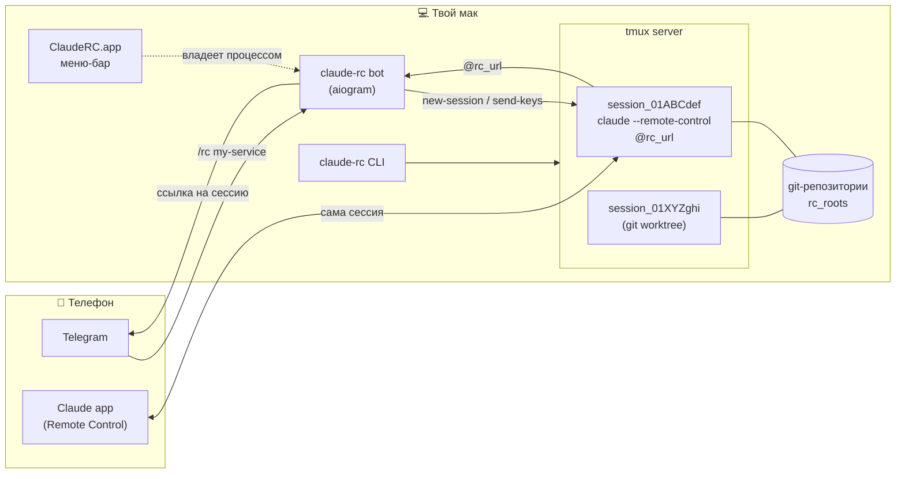

# claude-rc

**Кнопка «начать сессию Claude Code на своей машине», которой не хватало.**

[](https://github.com/nvinnikov/claude-rc/actions/workflows/ci.yml)
[](LICENSE)
[](https://www.python.org/downloads/)
[](#требования)
[](pyproject.toml)

*Read in English: [README.md](README.md)*


| | |
|---|---|
| **Что это** | Telegram-бот + приложение в меню-баре macOS + CLI, один код на всех |
| **Стек** | Python 3.12 / aiogram / tmux / git worktrees, Swift (SwiftPM) для приложения |
| **Гейт качества** | `ruff`, `mypy --strict` по коду **и** тестам, `pytest`, gitleaks — всё в CI |
| **Поставка** | GitHub Releases, Homebrew tap, `uv tool install` |

## Проблема

У Claude Code есть Remote Control: сессия крутится на твоей машине, а управляешь ей
с телефона или из веба. Штука отличная — читать длинные ответы, подтверждать права и
держать контекст в приложении Claude несопоставимо удобнее, чем в чате-обёртке.

Но начать сессию можно только сидя за машиной. Remote Control — это флаг у `claude`,
а `claude` кто-то должен набрать в терминале. Пока ты не за компьютером, входа нет:
инструмент дома, подписка дома, репозитории дома — а ты в магазине.

Облачные сессии эту дыру не закрывают, потому что решают другую задачу. В облаке нет
твоих локальных репозиториев, VPN, kubeconfig, залогиненных MCP-серверов и
незакоммиченной работы в рабочей копии. Поднимать под каждый вопрос отдельное
окружение — отдельная возня, а нужен-то один вход в то, что уже стоит и настроено.

Получается разрыв: **телефон — лучший способ вести сессию и при этом худший способ
её создать.**

## Решение

Telegram-бот на той же машине. Он делает ровно одно: запускает `claude` с Remote
Control в нужном каталоге и присылает ссылку. Дальше ты уходишь в приложение Claude
и работаешь там.

Сам бот в диалоге не участвует — и это осознанно. Первая версия была чатом с агентом,
и оказалась хуже приложения по всем статьям. Поэтому здесь он только «стартер»:
довести до каталога, нажать, получить ссылку.

С телефона это выглядит так:

1. `📁 PWD` — карточка с деревом каталогов;
2. тапаешь по папкам, пока не дойдёшь до нужной;
3. `▶️ Start Claude RC` — или `🌿 New worktree`, если параллельно уже что-то запущено;
4. приходит ссылка → `Open in Claude` → работаешь.

Ни одного набранного символа. Сессии живут в tmux, поэтому переживают перезапуск бота,
а подсесть к ним из терминала можно с любой машины — id для этого даёт карточка.

## С чем начинается сессия

Сессия, которая останавливается с вопросом, — это сессия, ради которой надо сидеть за
клавиатурой. Поэтому две вещи решаются до старта, а не во время него.

**Свежий код.** При `pull_before_start = true` рабочий каталог сначала перематывается от
origin через `claude-rc sync` — по тем же правилам, что и везде: грязное дерево и
отсоединённый HEAD не трогаются, история только вперёд. Для `--branch` тянется
**репозиторий**, и только потом создаётся worktree: `git worktree add` ветвится от текущего
HEAD, так что подтягивание после оставило бы новый worktree на несвежем коде. Карточка
говорит, что дало подтягивание, — молча поднятая на старом коде сессия хуже, чем
неподтянутый репозиторий.

**Права.** `permission_mode` задаёт, с чем сессия начинает: `manual` (ручной),
`acceptEdits`, `plan`, `auto`, `dontAsk` или `bypassPermissions`. Значение проверяется при чтении
конфига — claude на неизвестном режиме не стартует, и вместо опечатки человек увидел бы
мёртвую сессию. Гейта прав на стороне бота при этом не появляется, см. раздел «Права».
В CLI те же два — флагами: `claude-rc start --pull --permission-mode acceptEdits`.

## Четыре поверхности одной сессии

К живой сессии Claude Code можно подобраться четырьмя разными способами, и их легко
перепутать между собой. Две поверхности встроены в Claude Code, ради двух других
существует этот проект.

| Поверхность | Чем достаётся | Встроено? |
|---|---|---|
| **Разговор** — с телефона, из браузера, со второго компьютера | Remote Control: claude.ai/code, приложение Claude, Claude Desktop | да |
| **Терминал** — с любой машины | `ssh` + `tmux attach` в панель, где живёт сессия | да, если сессия поднята внутри tmux |
| **Создать** сессию где угодно в дереве, находясь не за машиной | — | **нет — ради этого и claude-rc** |
| **Управлять** сессиями: что живо, погасить, завести worktree, синхронизировать репозитории | — | **нет — тоже claude-rc** |

Первые две — собственные поверхности Claude Code, и переписывать их этот проект
намеренно не берётся. Что выяснилось при проверке, где проходит граница:

- **Терминалом подключиться к Remote Control по сети нельзя.** Клиентского режима для
  этого нет. `claude --resume <id>` во втором терминале поднимает *новый локальный
  процесс* поверх того же транскрипта, а не подключается к живой сессии — по документации
  Claude Code «prints a notice in the second terminal and leaves Remote Control off there
  instead of taking the session away from the first», а два терминала на одном транскрипте
  просто «interleave into one transcript». `--teleport` поднимает сессию Claude Code
  **on the web**, то есть облачную, а не RC-сессию с другой машины. Значит, попасть
  терминалом внутрь живой сессии можно единственным способом — прийти в тот терминал, где
  она работает. Поэтому сессии здесь живут в tmux: `tmux attach` работает с любой машины
  через ssh.

- **Сторонние оркестраторы сессий — из той же категории.** Публичного клиентского API у
  Remote Control нет, так что и они к сессии не подключаются: они сами запускают агента по
  SSH и гонят его ввод-вывод в своё окно. По сути это `ssh` + `tmux` с другим клиентом.
  На macOS `ssh -t host tmux -CC attach` отдаёт нативные вкладки iTerm2 ценой одного флага.

- **У «начать сессию где угодно в дереве» встроенного ответа нет.** Ближе всех серверный
  режим `claude remote-control`: один процесс, сессии создаются по требованию из приложения,
  каждой свой worktree — но он привязан к тому единственному каталогу, где запущен. Дотянуться
  с телефона до любого репозитория в `rc_roots` — то, что добавляет этот проект.

- **Зонтичный каталог работает и лучше, чем `--add-dir`.** Для раскладки
  `/services/repo-1 … repo-n`, где у родителя нет своего `.git`, сессию поднимают прямо в
  `/services`: всё остаётся внутри одного рабочего дерева, поэтому вложенные `CLAUDE.md` и
  настройки каждого репозитория подхватываются как обычно. У каталогов, добавленных через
  `--add-dir`, `.claude/` не читается вовсе.

- **Ни одного входящего порта здесь не открывается.** Remote Control ходит только исходящими
  HTTPS-запросами и ничего не слушает на машине, Telegram-бот опрашивает наружу, tmux
  локален. Веб-терминал сломал бы это свойство — поэтому его и нет.

Полный разбор, включая дизайн команды `claude-rc connect` для второй строки таблицы, —
в [docs/superpowers/specs/2026-09-04-connect-and-umbrella-design.md](docs/superpowers/specs/2026-09-04-connect-and-umbrella-design.md).

## Возможности

Два способа выбрать, где поднять сессию: дойти ногами или назвать по имени.

### Дойти ногами

```
/pwd            где я сейчас
/cd services    перейти
/cd ..          на уровень выше
```

`/pwd` присылает карточку: текущий путь и кнопки по подкаталогам (git-репозитории
помечены `●`), плюс `⬆️ ..` и `▶️ Start Claude RC`. С телефона это удобнее, чем
печатать пути: тапаешь по дереву и запускаешь, не набрав ни символа. Текущий
каталог переживает перезапуск бота.

`/cd` понимает относительный путь, абсолютный, `..` и `~`.

В git-репозитории рядом появляется `🌿 New worktree` — поднимает сессию в свежем
worktree с веткой вида `wt/20260730-131502`. Это способ работать параллельно с уже
запущенной сессией, когда имя ветки не важно.

`📚 Projects` (`/repos`) — плоский список всех git-репозиториев кнопками: тап
переносит прямо в каталог, ходить по дереву не нужно. Одинаковые имена (два клона
одного репозитория) разводятся именем родителя.

Под полем ввода висит постоянная клавиатура: `📁 PWD`, `💬 Chats`, `📚 Projects`,
`⌨️ Commands`. Появляется после `/start`.

### Синхронизация репозиториев

В каталоге, где есть хотя бы один git-репозиторий (сам он или его подкаталоги),
на карточке `/pwd` появляется `🔄 Sync`. Тап открывает режим выбора: по строке
на репозиторий — имя, ветка и состояние (⚠ нет upstream, `↓N`/`↑N` отставание
и опережение origin **на момент последнего fetch**, `✎` грязный, `✓` чистый,
🔒 в каталоге прямо сейчас живёт RC-сессия — ей ветку не переключат). Галочками
отмечаешь репозитории или жмёшь «Все»/«Никого», кнопка «Ветка» просит имя
ответом на то же сообщение (или `-`, чтобы остаться на текущей), «⤵️ Подтянуть»
запускает `sync` по отмеченным и присылает отчёт строкой на репозиторий —
те же правила и значки, что у `claude-rc sync` (см. «CLI»). «Отмена» возвращает
обычную карточку навигации.

`🔒` означает «ветку не переключим», а не «репозиторий не тронем»: сама
перемотка (`pull --ff-only`) в таком каталоге всё равно происходит — грязный
или разошедшийся с origin репозиторий отсекается раньше и не пострадает, но
файлы обновляются, пока в каталоге работает Claude. Claude Code сверяет время
изменения файла перед правкой и на изменённом извне откажется, но `git commit
-am` из той же сессии ляжет уже на обновлённое дерево.

### Назвать по имени

| Команда | Действие |
|---|---|
| `/rc <репо>` | Поднять сессию, ответить ссылкой |
| `/rc <репо> <ветка>` | То же, но в отдельном git worktree |
| `/rc` | Живые сессии |
| `/repos` | Все git-репозитории кнопками |
| `/rckill <имя>` | Погасить сессию (без имени — все) |
| `/wt` | Все worktree с кнопками |
| `/wtrm <имя>` | Удалить worktree |

Имя ищется по каталогам из `rc_roots` на глубину `scan_depth`. Точное совпадение
запускается сразу, несколько совпадений — кнопки выбора.

Сессия опознаётся по рабочему каталогу, а не по имени: повторный `/rc` в том же
каталоге вернёт существующую ссылку, а два клона репозитория с одинаковым именем
получат разные сессии.

В карточке каждой сессии **два входа**, и идентификатор у них общий: ссылка,
открывающая сессию в приложении Claude, и тот же `session_…` (`🖥`), открывающий
её в терминале. Как только claude печатает ссылку, tmux-сессия переименовывается
в id из неё — то есть то, что и так у тебя перед глазами в приложении, **и есть**
цель подсадки. Искать нечего, и попасть не в ту сессию невозможно: id уникальны
там, где имена каталогов — нет.

Telegram копирует всё, что в `<code>`, одним тапом. Карточка носит id, а не команду
целиком, потому что `ssh` и хост у каждой машины свои, а меняется только id —
остальное кладётся в алиас на каждой из твоих машин:

```bash
rc() { ssh -t home tmux attach -d -t "=$1"; }   # rc session_01ABCdef
```

Оба флага там не случайны. `-d` отцепляет прочие **tmux**-клиенты: панель
создаётся 120×40 без клиента, и второй клиент с узким окном переверстал бы TUI
тому, кто работает прямо сейчас. Приложения Claude это не касается — оно говорит
с сессией через API, а не через tmux. `=` — точное совпадение, чтобы цель не
попала в сессию, у которой имя лишь начинается так же.

Раз сессии различают id, имени каталога уникальность больше не нужна: карточки,
`/rckill` и `claude-rc stop` показывают и принимают его как ярлык. Если ярлык
подошёл к нескольким сессиям — трём клонам одного репозитория — не гасится ничего:
в ответ приходят их id, и выбираешь ты.

### Что запущено и что осталось

`💬 Chats` показывает обе половины картины.

Сначала живые сессии — по сообщению на каждую, с кнопками `Open in Claude` и
`⏹ Stop`. Если сессия работает в worktree, в карточке видна ветка и её состояние.

Следом — worktree, оставшиеся **без** сессии. Это и есть недоделанная работа:
у каждого кнопки `▶️ Start` (поднять сессию заново в том же каталоге) и
`🗑 Remove`. Отдельной кнопки под worktree внизу нет специально — без сессии он
не самостоятельная сущность, а остаток, и место ему рядом с сессиями.

`🗑 Remove` откажется удалять каталог с незакоммиченными изменениями или с
коммитами, которых нет ни на одном remote, и покажет причину с кнопкой
`🗑 Remove anyway`. Остановка сессии worktree не трогает вообще.

Текстом: `/rckill <имя>` (без имени — все), `/wt` — все worktree включая занятые,
`/wtrm <имя> [force]`.

### Параллельная работа в одной репе

Две сессии в одном каталоге неизбежно дерутся — общий индекс, общая ветка, общие
файлы. Поэтому вторая сессия по тому же репозиторию заводится через worktree:

```
/rc my-service feature/DEV-123
```

Ветка берётся существующая (в том числе remote-only), а если такой нет — создаётся
от текущего `HEAD`. Каталог появляется в `worktree_root` и переиспользуется при
повторном запуске.

`/wt` показывает, что в каждом worktree происходит. `/wtrm` откажется удалять
каталог с незакоммиченными изменениями или с коммитами, которых нет ни на одном
remote; перебить отказ можно явным `/wtrm <имя> force`. `/rckill` worktree не
трогает вообще — гасит только сессию.

### Доверие каталогу

В незнакомом каталоге `claude` спрашивает, доверяешь ли ты папке, и до ответа
ссылку не печатает. Пропустить диалог можно только в `--print`, а Remote Control
требует интерактива — поэтому бот присылает кнопку `Trust`. Отвечать за тебя он
не станет: до нажатия сессия просто ждёт. Спрашивается один раз на каталог,
дальше `claude` помнит сам.

## Требования

- `tmux` — `brew install tmux` (сессии живут в нём);
- `claude` в `PATH`;
- Python 3.12 и `uv`.

## Установка

Три способа, по возрастанию расстояния от исходников:

- **из клона репозитория** — `make install` (см. ниже);
- **из релиза на GitHub** — скачать `ClaudeRC.app.zip` и пакет со
  [страницы релизов](https://github.com/nvinnikov/claude-rc/releases), см. раздел
  «Релиз» ниже про снятие карантина;
- **через Homebrew** —

  ```bash
  brew install nvinnikov/tap/claude-rc-app
  ```

  поставит и тулзу, и приложение (формула `claude-rc` подтягивается как
  зависимость каска). Только тулзу без приложения — `brew install
  nvinnikov/tap/claude-rc`. Источник формулы и каска — `packaging/homebrew/`
  в этом репозитории, а сам tap — `nvinnikov/homebrew-tap` (см.
  `packaging/homebrew/README.md` про то, как он обновляется под релиз).
  Cask, как и ручная установка из зипа, ставит карантин на скачанный бандл —
  подписи Developer ID нет, поэтому после установки нужно то же самое снятие
  карантина, что и в разделе «Релиз» ниже (`brew` печатает команду в caveats
  после установки). Формула собирает `pydantic-core` (зависимость `aiogram`)
  из исходников на Rust, поэтому `brew install` занимает минуты, а не
  секунды, — это не зависание.

  Если тулза уже стоит через `uv tool install` (см. «Установка руками»
  ниже) в `~/.local/bin`, а этот каталог в `PATH` раньше, чем `brew --prefix`
  (`/opt/homebrew/bin` на Apple Silicon) — `claude-rc` по имени продолжит
  резолвиться в старую копию из `~/.local/bin`, даже после установки через
  Homebrew. `brew` предупреждает об этом в выводе (`shadowed by ...`); версию
  конкретной копии показывает `claude-rc version`, путь — `which claude-rc`.

`make install` ставит всё одной командой: тулзу `claude-rc` в `~/.local/bin` (через
`uv tool install`) и `ClaudeRC.app` в `/Applications`. Приложение перед копированием
гасится, если уже запущено, — иначе `cp` кладёт файлы под работающим процессом и
бандл получается наполовину старым. Если иконка в меню-баре после `make install`
пропала — это она, просто открой приложение заново.

Вместе с приложением гасится и Telegram-бот внутри него: пока не откроешь
`ClaudeRC.app` заново руками, команды из Telegram обрабатываться не будут.
Уже поднятые tmux-сессии (`rc-*`) установку при этом переживают — гасится
только сам процесс-обёртка, реестр сессий живёт в tmux, а не в памяти бота.

После установки приложение нужно один раз открыть руками и поставить галочку
`Launch at login` — сама она не включается.

Собрать и поставить только тулзу без приложения (например, на машине без графики):
`make install-tool`.

## Первый запуск

Сразу после установки конфига ещё нет — бот падает при старте, а `Reveal config`
в приложении открывает пустой каталог. `claude-rc setup` заполняет его интерактивно:

```bash
claude-rc setup
```

Спросит три вещи:

- **токен бота** от @BotFather — вводится скрыто (как пароль в терминале) и сразу
  проверяется вызовом `getMe`, опечатка не дойдёт до крэш-лупа бота;
- **твой Telegram user_id** — либо ввести самому, либо согласиться на автоподхват:
  бот до двух минут слушает входящие сообщения и берёт id отправителя первого
  адресованного ему. Автоподхват предлагается только на первом запуске, когда
  файла `config.toml` ещё нет вовсе, — если файл уже есть (даже битый, например
  с исчезнувшим каталогом в `rc_roots`) или процесс `claude-rc bot` уже виден в
  системе, визард автоподхват не предложит и сразу перейдёт к ручному вводу,
  чтобы не поднять второго поллера того же токена;
- **каталоги с репозиториями** через запятую (по умолчанию — `~/Documents`).

Пишет `~/.config/claude-rc/config.toml` с правами `600` (и сам каталог — `700`) —
в файле боевой токен; повторный запуск сужает права, даже если файл раньше лежал
с более широкими. Повторный `claude-rc setup` подставляет прежние значения
подсказкой и меняет только те, на которые дан новый ответ — пустой ответ оставляет
как было. Шесть технических полей, которые визард не спрашивает (`worktree_root`,
`state_path`, `scan_depth`, `launch_timeout_s`, `permission_mode`, `pull_before_start`),
при перезаписи переносятся из старого файла как есть; всё остальное за пределами этого списка (в том числе
комментарии человека) визард не хранит и теряет.

После — открой приложение ClaudeRC или запусти `claude-rc bot`.

### Установка руками

1. `uv sync`
2. Заполни `config.toml`, скопировав `config.example.toml`:
   - работа в клоне репозитория — `cp config.example.toml config.toml` (файл рядом
     с исходниками, для разработки без переменных окружения);
   - установленная тулза — `cp config.example.toml ~/.config/claude-rc/config.toml`
     (каталог создать заранее).

   Заполнить:
   - `bot_token` — от @BotFather
   - `allowed_user_id` — твой Telegram user_id (узнать у @userinfobot)
   - `rc_roots` — где искать репозитории
   - `permission_mode` — необязательно: с чем сессия начинает, чтобы не
     останавливаться с вопросом на каждом шаге, пока ты с телефоном в руках
   - `pull_before_start` — необязательно: подтягивать origin перед запуском
3. `chmod 600 config.toml`

Конфиг ищется по цепочке: путь из `$CLAUDE_RC_CONFIG`, если задан; иначе
`~/.config/claude-rc/config.toml`; иначе `config.toml` в текущем каталоге. Первый
существующий файл и используется.

**Типы полей строгие.** `bot_token`, `worktree_root`, `state_path` — строки;
`allowed_user_id`, `scan_depth` — целые числа; `launch_timeout_s` — число;
`rc_roots` — строка или список строк. Раньше значение неверного типа тихо
проходило через `int()`/`float()` (число в кавычках вроде `allowed_user_id =
"123"` — так принято записывать числа во многих форматах — читалось бы как
строка и падало уже при первом запуске бота), теперь `claude-rc doctor` или
запуск бота сразу называют поле и ожидаемый тип. Если после обновления бот
не стартует с сообщением вида `allowed_user_id: ожидалось целое число` —
поправь тип значения в `config.toml` (обычно это и значит «убери кавычки у
числа») и запусти заново.

## Запуск

Вручную: `make run` (то же самое, что `claude-rc bot` — см. раздел «CLI»).

Приложение в меню-баре. `make app` собирает `ClaudeRC.app` в `app/build/` —
Xcode не нужен, бандл складывается скриптом `app/make-app.sh` из бинаря SPM.
Перенеси `ClaudeRC.app` в `/Applications` и запусти: бот живёт внутри
приложения как дочерний процесс, иконка в меню-баре показывает его состояние,
`Stop bot`/`Start bot` включают и гасят его вручную. Галочка `Launch at login`
регистрирует приложение через `SMAppService` — тумблер переживает перезапуск.
Закрыл приложение (`Quit`) — бот погас вместе с ним.

Чтобы бот отвечал, мак не должен засыпать: `sudo pmset -c sleep 0`.

## CLI

Те же действия, что у бота, но из терминала на самой машине — не нужно ждать,
пока сообщение дойдёт из Telegram. Ставится вместе с пакетом:

```bash
uv tool install .
```

| Команда | Действие |
|---|---|
| `claude-rc version` | версия |
| `claude-rc sessions [--json]` | живые RC-сессии |
| `claude-rc start [путь] [--branch ветка] [--resume last\|id] [--pull] [--permission-mode m]` | поднять сессию (по умолчанию — текущий каталог) |
| `claude-rc stop <имя\|путь>` / `claude-rc stop --all` | погасить сессию |
| `claude-rc doctor [--json]` | проверить tmux, claude и конфиг |
| `claude-rc setup` | визард первого запуска — токен, user_id, каталоги (см. «Первый запуск») |
| `claude-rc update [--check] [--json]` | обновить тулзу тем же способом, каким ставили |
| `claude-rc sync [пути…] [--branch ветка] [--no-fetch]` | подтянуть репозитории из origin (см. «Синхронизация репозиториев») |
| `claude-rc bot` | запустить Telegram-бота на переднем плане — то же, что `make run` |

Диалог доверия незнакомому каталогу (см. «Доверие каталогу» выше) в CLI
спрашивается прямо на stdin: за терминалом сидит человек, и его ответ — это и
есть решение о правах на каталог, автоподтверждения нет и здесь. Без tty
(например, в скрипте) `start` не подвисает в ожидании ввода, а падает с кодом
2 и подсказкой `tmux attach -d -t =rc-<имя>`, чтобы ответить в панели вручную.

### Синхронизация репозиториев

```bash
claude-rc sync                        # все репозитории в текущем каталоге
claude-rc sync ~/code/a ~/code/b       # только перечисленные
claude-rc sync --branch main           # переключить на main перед подтягиванием
claude-rc sync --no-fetch              # посмотреть состояние, не ходя в сеть
```

Подтягивает изменения из origin строго перемоткой (`git pull --ff-only`) —
никаких `merge`, `rebase`, `stash` или `reset`. Репозиторий с незакоммиченными
изменениями не трогается вовсе: ни переключение ветки, ни подтягивание. Ветки,
разошедшиеся с origin, — отказ (`failed`): перемотка невозможна, разбираться
нужно руками. Отсутствие upstream — не ошибка, а пропуск с причиной в отчёте.

`--branch` переключает на ветку перед подтягиванием (существующую локально или
только в origin), но лишь у чистого репозитория, и не там, где переключение
опасно: ни в **любом** git worktree (обнулило бы счётчик неотправленных
коммитов и сняло бы защиту `wtrm` от удаления, живая сессия там или нет — см.
«Грабли» в CLAUDE.md), ни там, где прямо сейчас работает RC-сессия (подмена
ветки под живой сессией теряется в приложении молча). Сама перемотка эти
каталоги не обходит — только переключение ветки; см. `🔒` в разделе про бота
выше. `--no-fetch` не ходит в сеть вовсе: если репозиторий отстал, команда об
этом скажет, но подтягивать не станет — так можно свериться со списком
отставших, не тратя время на fetch по всем.

Каждая строка отчёта — один репозиторий: `⤵` подтянут, `=` уже актуален,
`·` пропущен, `✗` не получилось; в конце — сводка по числу каждого исхода.
Без аргументов синхронизируются репозитории прямо в текущем каталоге (не
рекурсивно); явные пути синхронизируют только их. Репозитории обходятся
параллельно.

## Как это устроено

`claude --remote-control` — интерактивная команда, без tty она уходит в режим
`--print` и падает. Панель tmux даёт tty, поэтому каждая сессия живёт в своей
tmux-сессии: заводится как `rc-<имя>` и переименовывается в свой `session_…`,
как только claude напечатает ссылку.



Отсюда два следствия:

- **сессии переживают рестарт бота** — реестр не в памяти бота, а в tmux;
- **можно подсесть с любой машины**: `ssh -t home tmux attach -d -t =session_01ABCdef`
  открывает тот же живой терминал, которым ты управляешь с телефона, — по тому самому id,
  который у тебя и так перед глазами в приложении Claude.

Ссылка на сессию хранится в user-опции tmux `@rc_url`: TUI перерисовывает панель
и вытирает её из видимого буфера, а после рестарта бота её нужно откуда-то взять.

### Карта модулей

| Модуль | Ответственность |
|---|---|
| `clauderc/remote.py` | всё общение с tmux: поднять сессию, добыть ссылку, погасить |
| `clauderc/worktrees.py` | git worktree под ветку: создать, осмотреть, удалить |
| `clauderc/browse.py` | навигация по дереву каталогов (`cd`/`ls`) |
| `clauderc/repos.py` | обход `rc_roots` в поисках git-репозиториев |
| `clauderc/state.py` | текущий каталог между перезапусками (JSON) |
| `clauderc/config.py` | чтение `config.toml` |
| `clauderc/bot.py` | aiogram-хендлеры, карточки и кнопки |
| `clauderc/paths.py` | где лежат конфиг, лог и хранилище диалогов Claude Code |
| `clauderc/history.py` | диалоги Claude Code для каталога (для резюма) |
| `clauderc/watch.py` | опрос tmux: замечает исчезнувшие сессии, метит намеренные гашения |
| `clauderc/cli.py` | команда `claude-rc`: те же действия из терминала |
| `clauderc/sync.py` | состояние репозитория относительно origin и подтягивание |
| `app/` | Swift-пакет `ClaudeRCMenu`: приложение в меню-баре, владеющее процессом бота |

Вся логика — в модулях, `bot.py` только собирает из неё сообщения. Неочевидные
ограничения, вокруг которых построен код (ключ сессии, синтаксис target в tmux,
`callback_data` на 64 байта, защита worktree от `sync --branch`), собраны в
[CLAUDE.md](CLAUDE.md#грабли-на-которые-уже-наступали) — в английском README они
вынесены отдельным разделом «Design notes».

## Права

**Гейта прав на стороне бота нет.** RC-сессия интерактивная, разрешения на запись
и выполнение команд выдаются в приложении Claude. Единственная защита — проверка
`allowed_user_id`: кто её прошёл, получает на этой машине полноценный Claude Code
со всеми токенами в `~`. Изоляции нет, это осознанный размен.

**Превью старых диалогов уходит в Telegram.** Когда в каталоге уже есть история,
бот предлагает выбор — новый диалог, продолжить последний или один из прежних —
и подписывает кнопки первыми 80 символами первого сообщения человека из
`~/.claude/projects`. Раньше в Telegram уезжали только пути, теперь — обрывок
переписки. Адресат один — владелец бота, инъекции текст кнопки не несёт, но если
в первом сообщении диалога был вставлен секрет, он окажется на серверах Telegram.
Это осознанный размен ради удобства резюма, а не недосмотр. Выключить можно, не
трогая код: не пользоваться развилкой резюма — поднимать сессии через `🌿 New
worktree` или `/rc <репо> <ветка>`, для свежего worktree истории ещё нет, и
превью показывать нечего.

### Обновление

```bash
claude-rc update --check    # что стоит, какой версии, есть ли новее
claude-rc update            # обновить
```

Настраивать и помнить нечего: команда сама выясняет, как эта копия поставлена, и запускает
штатную команду её канала. Клон перематывается и переустанавливается (`make install`, а без
приложения — `make install-tool`), установка через `uv tool` переставляется из git на тот
тег, номер которого команда только что назвала, Homebrew обновляется через `brew upgrade`,
вместе с каской, если приложение стоит.

Канал определяется по окружению, в котором работает процесс, а не по `claude-rc` в `PATH`:
имя у всех трёх одинаковое, путь — нет. Установка `make install` и установка из git-URL
попадают в одно и то же место, поэтому различает их квитанция `uv-receipt.toml` рядом с
окружением: у установки из каталога там `directory`, у установки из git — `git`. Без неё
обновление основного способа установки тянуло бы master поверх клона и никогда не
переустанавливало бы приложение.

Клон подтягивается через `claude-rc sync`, поэтому его правила действуют и здесь: грязное
дерево и отсоединённый HEAD не трогаются, история только перематывается вперёд. Если
подтянуть не вышло — переустановки не будет.

Сеть нужна только чтобы узнать последний релиз; на само обновление она не влияет:
недоступный GitHub будет назван, и обновление пойдёт дальше.

**Бот работает старым кодом, пока его не перезапустить** — `Stop bot` / `Start bot`
в приложении или заново `claude-rc bot`.

#### Из меню-бара

Приложение проверяет релизы при старте и раз в шесть часов, и пункт меню говорит, что
нашлось: `Check for updates…` с текущей версией под ним или `Update to 0.3.0…`, если есть
что ставить. `Update automatically` запускает обновление, не спрашивая; сама проверка идёт
в любом случае.

Проверка уходит в фон (она ходит в сеть) и читает `claude-rc update --check --json` —
версии и каналы установки приложение само не считает, поэтому разойтись с тулзой в них
не может. `--json` подразумевает `--check` и ничего не устанавливает.

Обновление открывается в Терминале, а не идёт молча, сразу по двум причинам. Оно гасит
приложение — переустановка кладёт файлы под работающим процессом, поэтому и `make install`,
и каска сначала его убивают, — и дочерний процесс умер бы вместе с ним на середине. И вывод
`git`, `make` или `brew` человеку надо видеть: молчаливое обновление, которое не получилось,
хуже отсутствия обновления. Скрипт гасит приложение сам, до переустановки (SIGTERM — оно
успевает корректно остановить бота), и открывает его заново независимо от того, вышло
обновление или нет. Живым сессиям это безразлично: они принадлежат tmux, а не боту.

## Релиз

Тег вида `v<версия>` (например `v0.1.0`) запускает `.github/workflows/release.yml`:
гейт, сборка `ClaudeRC.app.zip`, sdist и wheel, публикация релиза на GitHub. Версия
в теге обязана совпадать с `version` в `pyproject.toml` — иначе сборка падает на
первом шаге, до всякой работы. Это единственная защита от релиза, в котором
`claude-rc version` печатает не то, что написано на странице релиза.

Скачанный `.app` при первом запуске macOS откажется открывать: карантин
(`com.apple.quarantine`) ставится на всё, что пришло не из App Store, а подписи
Developer ID у нас нет — это стоит денег и учётной записи разработчика Apple,
которых для домашнего проекта заводить незачем. Снять карантин руками:

```bash
xattr -dr com.apple.quarantine /Applications/ClaudeRC.app
```

Предрелизные теги (`v0.1.0-rc1`) сейчас невозможны: проверка версии сравнивает
тег буквально с `version` из `pyproject.toml`, а `uv build` нормализует суффикс
вроде `-rc1` по PEP 440 (`0.1.0rc1`) — расхождение с тегом появится просто
с другой стороны. Пока это ограничение, не обходной путь: версии — только вида
`X.Y.Z`.

## Разработка

```bash
make check       # зеркало CI: ruff format --check, ruff check, mypy --strict, pytest
make format      # автоформат и автофиксы
make run         # запустить бота вручную
```

CI (GitHub Actions) гоняет те же четыре шага плюс скан секретов gitleaks.

Отдельным воркфлоу PR ревьюит Claude Code Action по правилам из
[CLAUDE.md](CLAUDE.md#code-review-guidelines). Чтобы он заработал, нужно два
разовых действия: поставить на репозиторий [GitHub App](https://github.com/apps/claude)
и положить токен в секреты —

```bash
claude setup-token                       # выдаст токен
gh secret set CLAUDE_CODE_OAUTH_TOKEN    # вставить его сюда
```

Без токена джоба тихо пропускается и PR не краснеет.

## Тесты

`make test` или `uv run pytest`

Сквозной тест поднимает настоящую tmux-сессию с заглушкой вместо `claude`;
без tmux он пропускается. Сессия живёт на отдельном tmux-сервере
(`CLAUDE_RC_TMUX_SOCKET`), изолированном от сервера по умолчанию, — так тест
не путается под ногами у рабочих `rc-*` сессий и их не видит бот-наблюдатель;
ту же переменную можно выставить и вручную, чтобы поднять песочницу отдельно
от боевых сессий.

## Лицензия

[MIT](LICENSE) © Nikita Vinnikov
